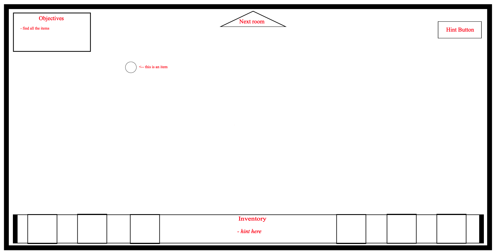
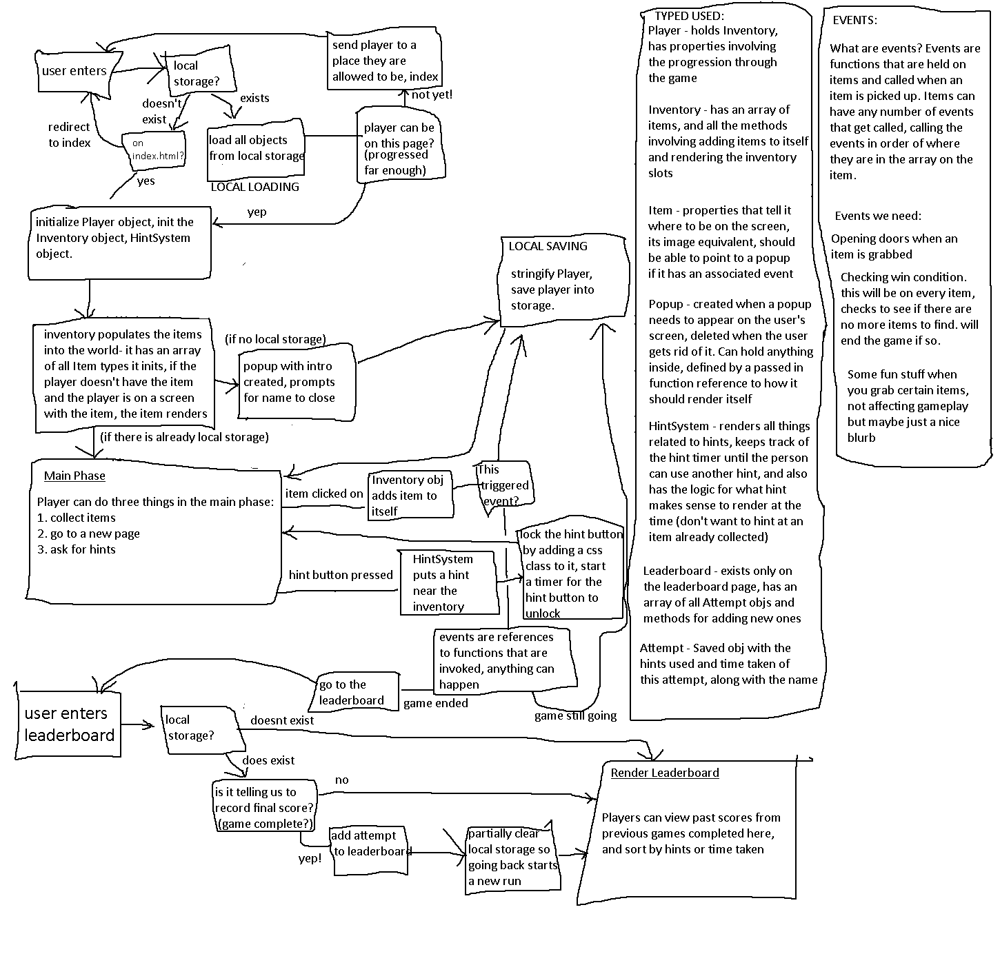
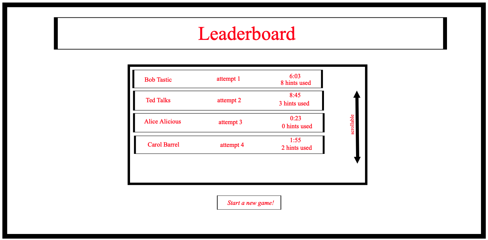
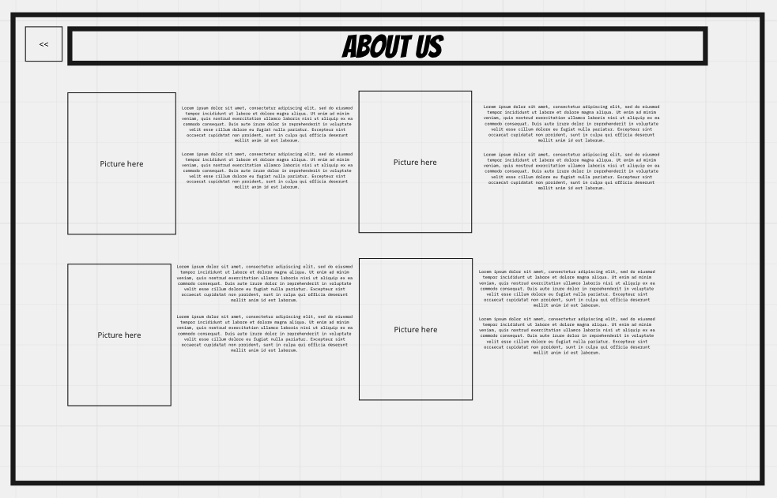

# git-help

Team Members:

* Hugo Thompson
* Harvey Francois
* Marta Deneke
* Danny Castro

## Brief Breakdown
  
> We are creating a where's waldo / find items / multiple rooms, set in the CodeFellows office. The main objective will be to solve a ***git conflict*** in order to complete the game. A player will be able to gain "items" to grant them access into the next room. If the player gets stuck they will have the ability to get hints to help them out.  

## File structure

```txt
.
├── DESIGN.md
├── PLAN.md
├── README.md
├── css
│ ├── reset.css
│ └── style.css
├── images
├── js
│ ├── app.js
│ ├── game.js
│ └── leaderboard.js
├── pages
│ ├── about-us.html
│ ├── classroom.html
│ ├── index.html
│ └── leaderboard.html
└── whiteboard_images
    ├── domain-modeling.png
    ├── leaderboard.png
    └── wireframe.png
```

## Wireframe



## Domain modeling



## Leaderboard



## About us


